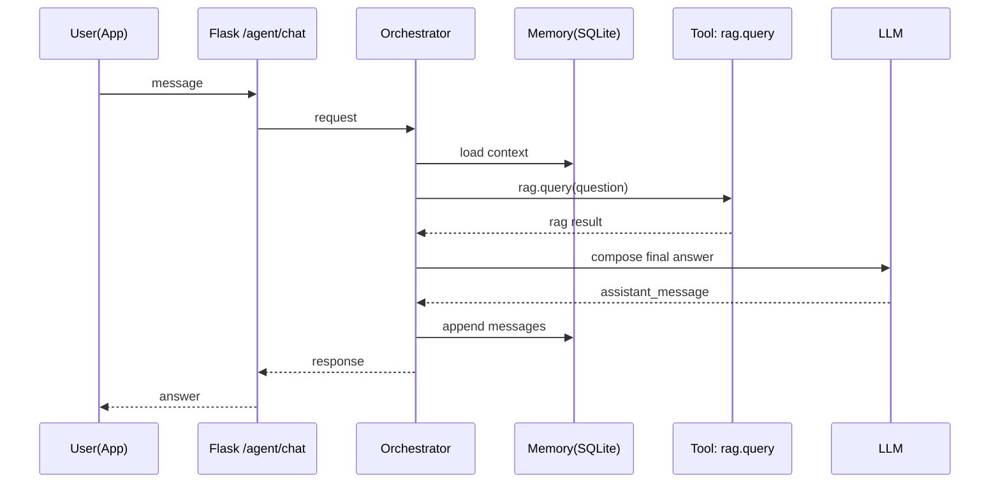
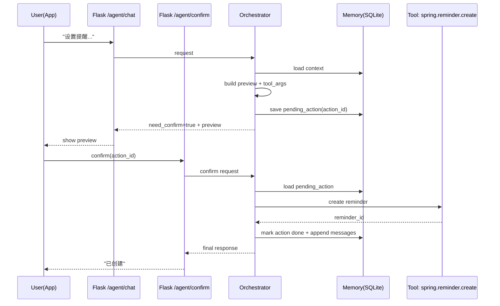

# MedicalAssistant Agent 架构设计（Flask）

日期：2026-02-19  
范围：仅设计，不落代码

## 1. 目标与约束

### 目标
- **统一对话入口**：面向 App 首页，用户只有一个接口可调用（Chat UI）。
- **工具自治调用**：Agent 自主决定调用：
  - RAG（已跑通）
  - 预测模型（当前仅占位，后续接推理）
  - 联邦学习（当前仅占位）
  - 业务联动（调用 Spring Boot 写入数据库，如创建用药闹钟）
- **多轮上下文**：提供 Memory 保存会话上下文，至少支持会话级短期记忆与会话摘要。
- **可观测性**：提供可开关的 trace，便于调试“选了哪个工具、为何、结果如何”。

### 关键约束（已确认）
- **写操作需要二次确认**：写库前必须把将写回的数据展示给用户，待确认后执行。
- **Memory 单机落地**：优先简单实现（SQLite / 文件），不作为主要性能瓶颈优化对象。
- **Spring Boot 与 Flask 同一台云服务器部署**：服务间调用优先走 `127.0.0.1`/本机端口，避免公网暴露。

### 非目标（当前阶段不做）
- 不做复杂多 Agent（多角色/多模型/反思循环等）。
- 不做强实时流式输出（SSE/WebSocket 可后续加）。
- 不做完整合规体系（仅在设计中预留隐私边界与清除能力）。

---

## 2. 总体架构

### 2.1 组件划分
- **Agent API（Flask 路由）**：对外统一入口 `POST /agent/chat` + 二次确认 `POST /agent/confirm`。
- **Orchestrator（编排器）**：
  - 读取 Memory
  - 识别意图/选择工具
  - 执行工具调用
  - 汇总结果并生成最终回复
- **Tools（工具层）**：RAG / SpringBoot / 预测 / 联邦学习等能力统一封装为工具。
- **Memory（记忆层）**：单机 SQLite 保存会话消息、摘要与待确认动作。
- **LLM（决策与生成）**：用于路由决策（tool routing）与回答生成（可带 grounding 校验与 fallback）。

### 2.2 Mermaid：组件图

```mermaid
flowchart LR
  App[Mobile App Chat UI]
  A[Flask: /agent/chat]
  O[Agent Orchestrator]
  M[Memory: SQLite]
  TR[Tool Registry]

  RAG[RAG Tool\n(local rag_light)]
  SB[Spring Boot Tool\n(127.0.0.1:PORT)]
  PRED[Predict Tool\n(placeholder)]
  FL[Federated Tool\n(placeholder)]
  LLM[LLM Provider\n(Ollama/OpenAI)]

  App --> A --> O
  O <--> M
  O --> TR
  O --> LLM
  TR --> RAG
  TR --> SB
  TR --> PRED
  TR --> FL
  O --> RAG
  O --> SB
  O --> PRED
  O --> FL
  O --> A
```

---

## 3. 统一接口设计（给 App / Postman）

> 设计目标：手机端永远只调用 Agent 接口；后端自行决定工具调用。

### 3.1 `POST /agent/chat`

**Request（建议）**
```json
{
  "user_id": "u_123",
  "session_id": "s_456",
  "message": "帮我设置一个阿司匹林每天晚上8点提醒",
  "with_trace": true,
  "client_context": {
    "timezone": "Asia/Shanghai",
    "locale": "zh-CN",
    "app_version": "1.0.0"
  }
}
```

**Response（两类）**

A) 纯读操作（例如 RAG 查询）
```json
{
  "success": true,
  "assistant_message": "...",
  "actions": [],
  "need_confirm": false,
  "trace": {"...": "..."}
}
```

B) 写操作需要二次确认（返回预览而不执行）
```json
{
  "success": true,
  "assistant_message": "我将为你创建如下提醒，请确认是否保存：",
  "need_confirm": true,
  "confirm": {
    "action_id": "act_20260219_abcdef",
    "action_type": "reminder.create",
    "preview": {
      "medicine_name": "阿司匹林",
      "schedule": "daily",
      "time_of_day": "20:00",
      "start_date": "2026-02-19"
    },
    "expires_in_sec": 300
  },
  "actions": [],
  "trace": {"...": "..."}
}
```

### 3.2 `POST /agent/confirm`

**Request（确认执行写操作）**
```json
{
  "user_id": "u_123",
  "session_id": "s_456",
  "action_id": "act_20260219_abcdef",
  "confirm": true
}
```

**Response**
```json
{
  "success": true,
  "assistant_message": "好的，已创建提醒。",
  "actions": [
    {
      "type": "reminder.create",
      "status": "ok",
      "data": {"reminder_id": 98765}
    }
  ],
  "need_confirm": false
}
```

**幂等建议**
- `action_id` 作为幂等键：同一个 action_id 多次 confirm 不重复创建。

---

## 4. 工具层（Tools）设计

### 4.1 工具抽象
每个工具定义：
- `name`：如 `rag.query`
- `side_effect`：`read` / `write`
- `input_schema`：入参结构
- `output_schema`：出参结构
- `timeout_ms`：超时
- `policy`：权限/二次确认/幂等

工具被 Orchestrator 以统一方式调用：
- 输入：结构化参数
- 输出：结构化结果 + meta（耗时/错误）

### 4.2 初期工具清单（对应你们三大模块 + 联动）

#### A) `rag.query`（读）
- **用途**：药物/不良反应/适应症/结局等知识问答。
- **输入**：
```json
{"question":"...","with_trace":false,"with_timing":false,"topk":10}
```
- **输出**：
```json
{"answer":"...","success":true,"meta":{"rag_version":"..."}}
```

#### B) `spring.reminder.create`（写，需二次确认）
- **用途**：创建/保存用药提醒（写数据库）。
- **输入（建议）**：
```json
{
  "user_id":"u_123",
  "medicine_name":"阿司匹林",
  "schedule":"daily",
  "time_of_day":"20:00",
  "start_date":"2026-02-19",
  "end_date":null,
  "note": "饭后"
}
```
- **输出（建议）**：
```json
{"status":"ok","reminder_id":98765}
```

#### C) `predict.infer`（读，占位）
- **用途**：风险预测/个性化评估（后续接模型推理）。
- **当前行为建议**：返回 `not_implemented`，同时给用户解释“功能建设中，可先提供科普”。

#### D) `fl.train` / `fl.status`（写/读，占位）
- **用途**：联邦学习训练/状态查询（后续）。
- **当前行为建议**：返回 `not_implemented`。

---

## 5. Orchestrator：路由与执行策略

### 5.1 路由（Tool Routing）建议
采用“规则兜底 + LLM 决策”的混合：

- 明确关键词/意图（规则直达）：
  - 包含“提醒/闹钟/每天/几点/设置”：倾向 `spring.reminder.create`（但只生成预览，等待确认）
  - 包含“删除提醒/关闭提醒/修改提醒”：倾向 `spring.reminder.*`

- 医学知识问答：倾向 `rag.query`

- “预测/风险/概率/评分”：倾向 `predict.infer`（占位）

- “联邦学习/训练/上传数据”：倾向 `fl.*`（占位）

### 5.2 执行（最小可用流程 v1）
1) 读取 Memory（最近 N 轮 + session_summary）
2) LLM/规则：产出 `selected_tool` + `tool_args` 或者 `direct_answer`
3) 若是写操作：生成 preview 并落库为 pending action，返回 `need_confirm=true`
4) 若是读操作：执行工具 -> 汇总结果 -> LLM 生成最终回复（必要时做 grounding 校验）
5) 写入 Memory（用户消息、assistant_message、工具调用摘要）

---

## 6. Memory：单机 SQLite 方案

### 6.1 为什么用 SQLite
- 单机简单可靠、可备份、无额外依赖。
- 适合当前“先跑通 Agent”阶段。

### 6.2 表结构建议（设计）

- `sessions(session_id, user_id, created_at, updated_at, summary_text)`
- `messages(id, session_id, role, content, created_at)`
- `pending_actions(action_id, session_id, user_id, action_type, preview_json, tool_args_json, status, created_at, expires_at)`

### 6.3 记忆策略建议
- 最近 N 轮：例如 10 轮（控制 token）
- 超过 N 轮：把更早内容滚动总结进 `summary_text`

### 6.4 隐私与清理（预留）
- 提供清理接口（后续实现）：
  - `DELETE /agent/sessions/{session_id}`
  - `DELETE /agent/users/{user_id}`

---

## 7. Flask ↔ Spring Boot 联动（同机部署）

### 7.1 网络建议
- 由于同机部署：**优先调用 `http://127.0.0.1:<SPRING_PORT>`**。
- 不建议暴露 Spring 的写接口到公网。

### 7.2 鉴权建议（服务间）
- Flask 调 Spring Boot 带 `X-Service-Token`（配置在 env）。
- Spring Boot 校验该 token，防止本机端口被其它进程滥用。

### 7.3 失败/重试建议
- 写接口短超时（例如 3-5s）。
- 失败返回清晰错误，并保留 pending action 让用户可重试确认。

---

## 8. 可观测性（trace/版本/调试开关）

建议在 Agent 返回中提供：
- `agent_version`
- `tools_called[]`
- `tool_timings`
- `rag_versions`（例如 relation_agg_version、answer_version）

示例：
```json
{
  "trace": {
    "agent_version": "v1_2026-02-19",
    "router": "rules_then_llm",
    "tools_called": ["rag.query"],
    "tool_timings": {"rag.query": 0.8},
    "rag": {"relation_agg_version": "...", "answer_version": "..."}
  }
}
```

---

## 9. Mermaid：时序图（读 vs 写）

### 9.1 读操作（RAG）


### 9.2 写操作（二次确认 + 写库）


---

## 10. 目录规划（仅规划，不创建代码）

建议后续在 Flask 侧按以下结构实现：
- `app/routes/agent.py`：对外路由（chat/confirm）
- `app/services/agent/`：orchestrator、router、tool_registry
- `app/services/agent/tools/`：rag_tool、spring_tool、predict_tool、fl_tool
- `app/services/predict/`：预测模型占位
- `app/services/federated/`：联邦学习占位
- `app/services/agent/memory/`：sqlite 存取封装

---

## 11. 下一步（进入实现前的最小决策）

已确定：
- 写操作二次确认：是
- Memory 单机：SQLite
- Spring Boot 同机：127.0.0.1 调用

实现阶段建议从最小闭环开始：
1) `POST /agent/chat`：只做路由（规则优先）+ `rag.query`
2) `spring.reminder.create`：先只生成 preview 与 pending_action，不真正写库
3) `POST /agent/confirm`：再接 Spring Boot 写库
4) 加 trace 与 agent_version

