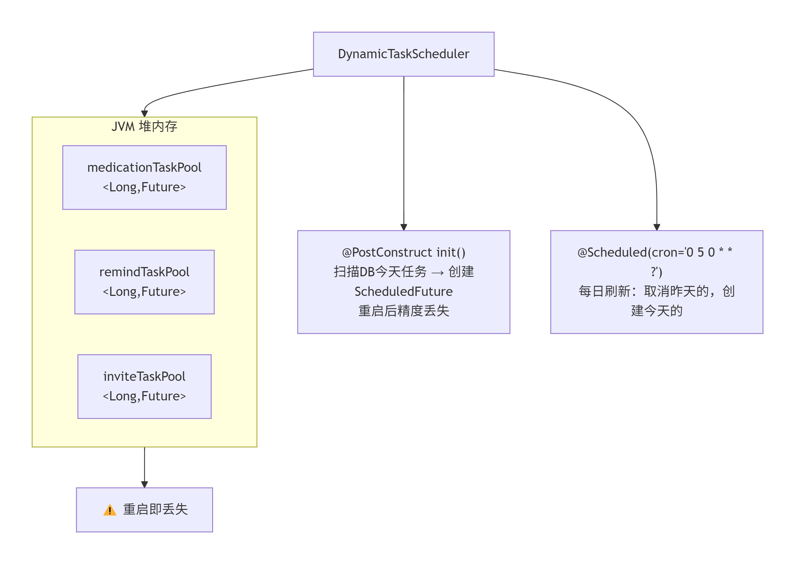
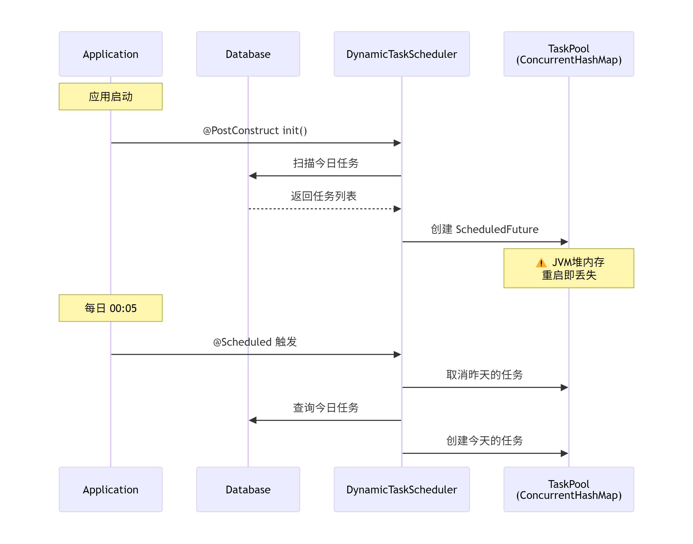
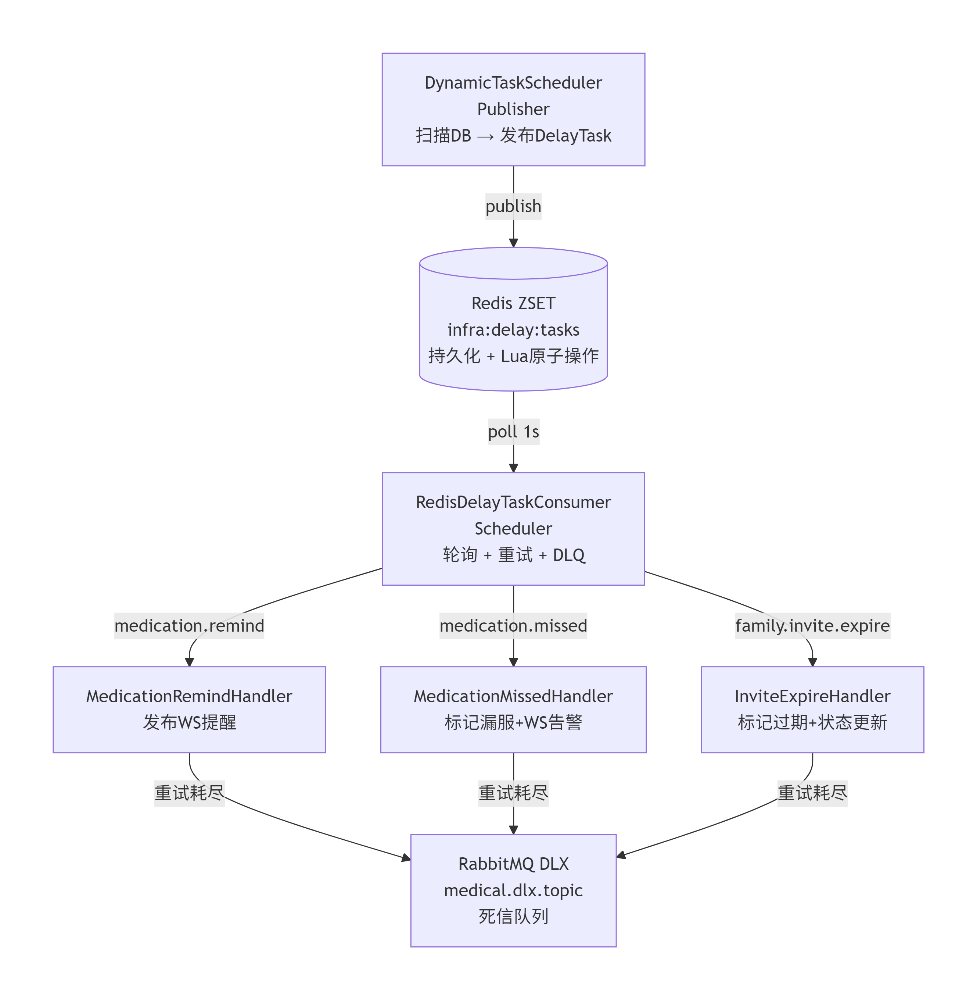
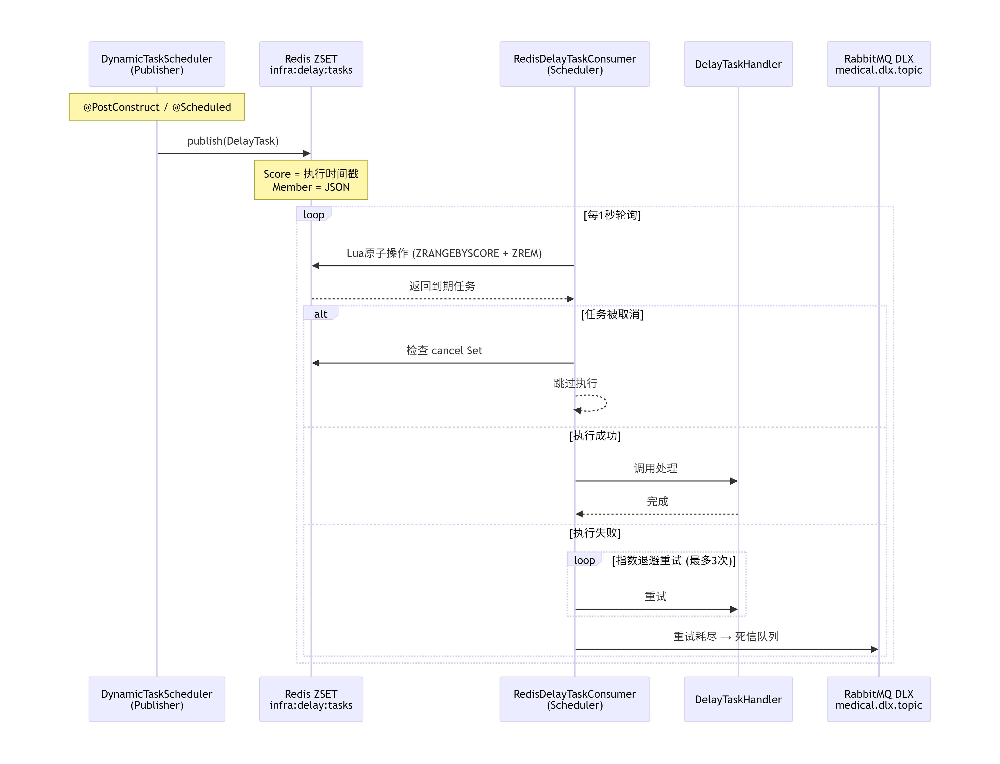

# U6: 延迟任务可靠性 — 改进报告

> **优化目标**: 确保延迟任务（用药提醒、邀请过期等）在系统重启或异常后仍能可靠执行
> **完成日期**: 2026-05-16

---

## 一、改进概览

| 子用例 | 描述 | 优先级 | 状态 |
|--------|------|--------|------|
| U6.1 | 延迟任务持久化 — Redis ZSET 支持重启恢复 | P0 | 已完成 |
| U6.2 | 失败重试机制 — 指数退避重试，最多3次 | P0 | 已完成 |
| U6.3 | 任务状态监控 — 延迟任务执行情况可视化 | P1 | 已完成 |

---

## 二、架构对比

### 2.1 改进前架构

架构图：

时序图：

```
问题：
✗ 重启 → 所有 ScheduledFuture 丢失 → 只能靠 @PostConstruct 重建
✗ 多实例 → 每个实例都会执行一遍 → 重复调度
✗ 故障 → 崩溃期间的延迟任务全部丢失
✗ 无重试 → 执行失败直接丢弃
✗ 无监控 → 无法查看延迟任务队列状态
```

### 2.2 改进后架构

架构图：

时序图：

```
优势：
✓ Redis ZSET 持久化 → 重启自动恢复，无需重建
✓ Lua 原子 POP → 多实例部署安全，不会重复执行
✓ 指数退避重试 → 临时故障自动恢复
✓ 死信队列兜底 → 最终失败可追溯、可手动重试
✓ 监控 API → GET /api/admin/delay-tasks/status
```

---

## 三、逐项对比

### 3.1 U6.1 — 延迟任务持久化

| 维度 | 改进前 | 改进后 |
|------|--------|--------|
| **存储方式** | JVM 堆内存 `ConcurrentHashMap<Long, ScheduledFuture<?>>` | Redis ZSET `infra:delay:tasks` |
| **重启恢复** | `@PostConstruct` 重新扫描 DB，精度丢失（只能按天批量） | Redis 持久化，精确到毫秒级恢复 |
| **多实例安全** | 不支持 — 每个实例独立调度，重复执行 | Lua 脚本原子 POP，多实例轮询不会重复 |
| **取消机制** | `future.cancel(true)` — 仅限本 JVM | Redis Set `infra:delay:canceled` 标记 + 消费前检查 |
| **任务生命周期** | 仅在内存中，无法追溯 | Redis ZSET 中可查询待执行任务，DLQ 中可查询失败任务 |

**关键改进点**：任务从"进程内 ephemeral"变为"基础设施层 persistent"，存储介质从 JVM 堆迁移到 Redis，解决了重启丢失和分布式协调问题。

### 3.2 U6.2 — 失败重试机制

| 维度 | 改进前 | 改进后 |
|------|--------|--------|
| **重试策略** | 无 — 执行失败直接丢弃，仅写日志 | 指数退避: 2s → 4s → 8s → ... max 60s |
| **最大重试** | 0 次 | 3 次 |
| **重试耗尽** | 静默丢弃 | 投递至 RabbitMQ 死信队列 (`medical.dlx.topic`) |
| **DLQ 消息** | 无 | 包含 `taskId`, `taskType`, `bizId`, `lastError`, `failedAt` |
| **可恢复性** | 不可恢复 | DLQ 消息可手动重发 |

**重试公式**: `backoff(retryCount) = min(60, 2^retryCount)` 秒

```
第1次失败 → 等待 2s 后重试
第2次失败 → 等待 4s 后重试
第3次失败 → 等待 8s 后重试
第4次失败 → 超过 maxRetry=3，投递至死信队列
```

### 3.3 U6.3 — 任务状态监控

| 维度 | 改进前 | 改进后 |
|------|--------|--------|
| **队列可见性** | 无 — 只能通过 `getActiveTaskCount()` 查看内存池大小 | `GET /api/admin/delay-tasks/status` |
| **监控指标** | 无 | `pendingTasks`（待执行）、`overdueTasks`（已到期未执行）、`canceledCount`（已取消） |
| **可观测性** | 仅日志 | 日志 + REST API + Spring Actuator metrics |

**API 响应示例**:
```json
{
  "pendingTasks": 15,
  "overdueTasks": 0,
  "canceledCount": 3
}
```

---

## 四、代码变更清单

### 4.1 新增文件

| 文件 | 说明 |
|------|------|
| `common/infra/delay/handler/MedicationRemindHandler.java` | 用药提醒处理器 — 发送 WS 提醒推送 |
| `common/infra/delay/handler/MedicationMissedHandler.java` | 漏服标记处理器 — 标记漏服 + 广播告警 |
| `common/infra/delay/handler/InviteExpireHandler.java` | 邀请过期处理器 — 自动过期 pending 邀请 |
| `common/infra/delay/DelayTaskAdminController.java` | 监控 REST API |

### 4.2 修改文件

| 文件 | 变更内容 |
|------|---------|
| `common/infra/delay/DelayTaskPublisher.java` | 接口新增 `cancel(taskType, bizId)` 方法 |
| `common/infra/delay/RedisDelayTaskPublisher.java` | 新增 `cancel()`、`isCanceled()`、`removeCanceledFlag()` 方法 |
| `common/infra/delay/RedisDelayTaskConsumer.java` | 新增取消检查、DLQ 投递；注入 `RabbitTemplate` 和 `RedisDelayTaskPublisher` |
| `common/schedule/DynamicTaskScheduler.java` | 移除 3 个 `ConcurrentHashMap` 池；改为通过 `DelayTaskPublisher` 发布到 Redis ZSET |
| `resources/application.yaml` | `infra.delay.redis.enabled: false` → `true` |
| `resources/application-scheduler.yaml` | `infra.delay.redis.enabled: false` → `true` |

---

## 五、延迟任务类型映射

| taskType | Handler | 触发时机 | bizId |
|----------|---------|---------|-------|
| `medication.remind` | `MedicationRemindHandler` | 服药时间前 5 分钟 | 任务 ID |
| `medication.missed` | `MedicationMissedHandler` | 服药时间后 2 分钟 | 任务 ID |
| `family.invite.expire` | `InviteExpireHandler` | 邀请创建后 48 小时 | 申请/邀请 ID |

---

## 六、数据流示意

```
用户创建服药计划
  │
  ▼
PlanServiceImpl.createPlan()
  │
  ├── 1. 生成今日任务 → INSERT medication_task
  │
  └── 2. DynamicTaskScheduler.addTaskSchedule(task)
        │
        ├── scheduleTaskTimeout(task)
        │     │
        │     ├── RedisDelayTaskPublisher.publish(
        │     │     DelayTask{type:"medication.missed", bizId:"123",
        │     │               executeAt: taskTime + 2min})
        │     │   → redis ZADD infra:delay:tasks {score=timestamp, member=JSON}
        │     │
        │     └── RedisDelayTaskPublisher.publish(
        │           DelayTask{type:"medication.remind", bizId:"123",
        │                     executeAt: taskTime - 5min})
        │         → redis ZADD infra:delay:tasks
        │
        ▼
  RedisDelayTaskConsumer.pollReadyTasks() [每1秒轮询]
        │
        │  Lua: ZRANGEBYSCORE + ZREM (原子操作)
        │
        ├── 检查 canceled set → 跳过已取消任务
        │
        ├── MedicationRemindHandler.handle()
        │     → publishEvent(UserTaskMedicineRemindEvent)
        │     → WebSocket 推送给用户
        │
        └── MedicationMissedHandler.handle()
              → taskMapper.updateStatus(2)
              → publishEvent(FamilyMedicineAlarmEvent)
              → WebSocket 推送给家庭成员

用户标记任务为已完成
  │
  ▼
TaskServiceImpl.updateTaskStatus(taskId, status=1)
  │
  └── DynamicTaskScheduler.cancelTaskSchedule(taskId)
        │
        ├── RedisDelayTaskPublisher.cancel("medication.missed", "123")
        │     → SADD infra:delay:canceled "medication.missed:123"
        │
        └── RedisDelayTaskPublisher.cancel("medication.remind", "123")
              → SADD infra:delay:canceled "medication.remind:123"
```

---

## 七、验收清单

- [x] 系统重启后，Redis 中的未执行延迟任务自动恢复（Redis 持久化保障）
- [x] 延迟任务执行失败后，按指数退避策略重试（2s → 4s → 8s，最多 3 次）
- [x] 重试耗尽后，任务投递至 RabbitMQ 死信队列 (`medical.dlx.topic`)
- [x] 已取消的任务不会被消费执行（通过 `infra:delay:canceled` Set 标记）
- [x] `GET /api/admin/delay-tasks/status` 可查询延迟任务队列状态
- [x] Lua 脚本原子 POP 保证多实例部署不会重复执行
- [x] 前端接口不变，`TaskServiceImpl`、`PlanServiceImpl`、`FamilyGroupServiceImpl` 调用方式不变
- [x] 3 种延迟任务处理器全部就位：用药提醒、漏服标记、邀请过期

---

## 八、配置说明

```yaml
# application.yaml (主配置)
infra:
  legacy-scheduler:
    enabled: true        # DynamicTaskScheduler — 扫描 DB 并发布延迟任务
  delay:
    redis:
      enabled: true      # RedisDelayTaskConsumer — 轮询执行延迟任务
      poll-interval-ms: 1000   # 轮询间隔 1 秒
      batch-size: 100          # 每次最多弹出 100 条

# application-scheduler.yaml (调度服务)
# 以上配置在 scheduler 服务中生效
# 其他服务 (medication/family 等) 保持 enabled: false
```
